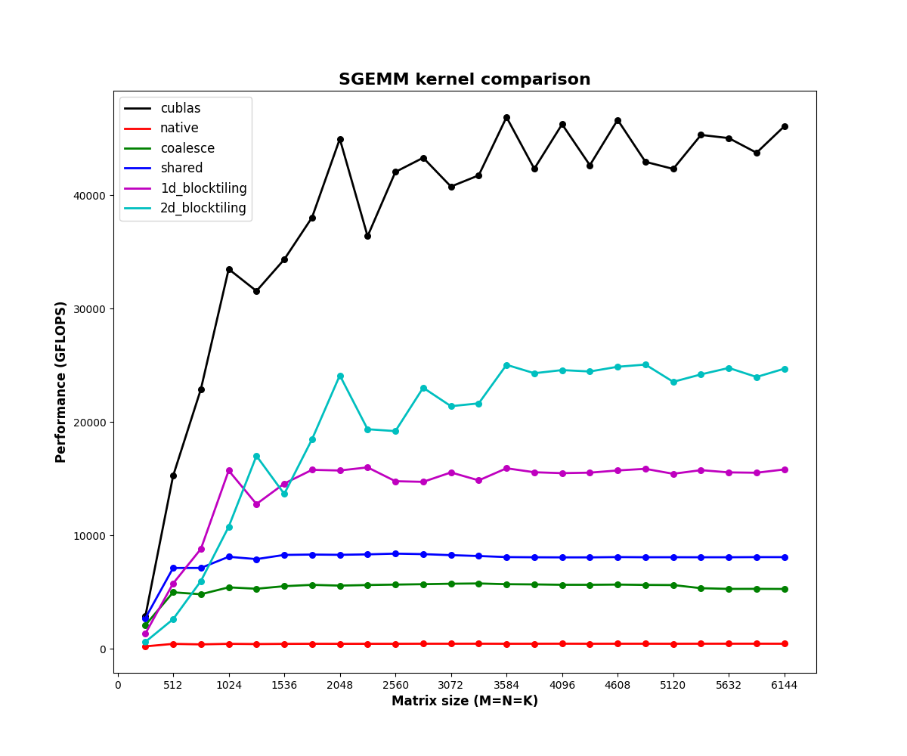

# CUDA SGEMM from scratch

SGEMM performs `C = alpha*A*B + beta*C` at single (32-bit) precision.

I wrote six versions of this kernel, starting from the most obvious one and
optimising step by step to **55x faster**, which is **~53% of FP32 cuBLAS** on
an H200. Then I wrapped the fastest one as a PyTorch C++/CUDA extension so I
can call it from Python like any other torch op.

The point of this project was not to beat cuBLAS. The point was to understand
*why* cuBLAS is fast, by hitting every bottleneck myself and fixing them one at
a time.

Matrix dimensions used everywhere in this repo:

```
A = M x K
B = K x N
C = M x N
```

All matrices are row-major.

---

## Results

Square matrices, `M = N = K` from 256 to 6144, H200, FP32. Every kernel is
verified against cuBLAS before it is timed.



Three things I'd point out in this plot:

- **The red line along the bottom is the naive kernel.** It never leaves ~450
  GFLOPS at any size. Uncoalesced access is so expensive that nothing else
  about the kernel matters.
- **Everything plateaus after ~1536.** Below that the matrices are too small to
  fill the GPU, so you're measuring launch overhead and idle SMs rather than
  the kernel. This is why I quote my numbers at 4096.
- **The gaps between the lines are the whole project.** Each band is one
  optimisation, and they're all roughly multiplicative.

| Kernel | 1024 | 2048 | 4096 | 6144 | % of cuBLAS @ 4096 |
|---|---|---|---|---|---|
| 1. native | 437 | 438 | 449 | 446 | 1.0% |
| 2. memory coalescing | 5421 | 5572 | 5647 | 5277 | 12.2% |
| 3. shared memory tiling | 8117 | 8290 | 8064 | 8086 | 17.4% |
| 4. 1D block tiling | 15723 | 15729 | 15493 | 15821 | 33.5% |
| 5. 2D block tiling | 10764 | 24122 | **24587** | 24711 | **53.1%** |
| 0. cuBLAS | 33499 | 44984 | 46276 | 46099 | — |

(GFLOPS. Higher is better.)

The step-by-step ladder at 4096:

```
native  -> coalesce         12.58x     <- by far the biggest single win
coalesce -> shared           1.43x
shared  -> 1D blocktiling    1.92x
1D      -> 2D blocktiling    1.59x
-------------------------------------
native  -> 2D blocktiling   54.76x
```

### About these numbers

These are from a run when the H200 was essentially idle. I had to wait for it,
because it's a shared card and most of my earlier benchmarking was done while
other people's jobs were running.

That turned out to be a useful accident. Here is the same sweep at 4096 on a
busy GPU vs an idle one:

| | busy | idle | ratio |
|---|---|---|---|
| native | 212 | 449 | 2.12x |
| coalesce | 2679 | 5647 | 2.11x |
| shared | 3715 | 8064 | 2.17x |
| 1D blocktiling | 7462 | 15493 | 2.08x |
| 2D blocktiling | 11485 | 24587 | 2.14x |
| cuBLAS | 22552 | 46276 | 2.05x |

Contention cost me almost exactly **half my throughput across the board**, and
the *relative* ordering never moved. My step-by-step ladder on the busy run was
`12.63 / 1.39 / 2.01 / 1.54`; on the idle run it is `12.58 / 1.43 / 1.92 /
1.59`. Every step within a few percent.

That is worth knowing as a benchmarking lesson: on a contended GPU the absolute
GFLOPS are meaningless, but **speedup ratios between kernels are still
trustworthy**, because everything is being throttled by the same factor. I was
able to do all my optimisation work on a busy card and only needed clean time
for the final numbers.

The old busy-GPU plot is kept at `images/all_kernels.png` for comparison — the
spiky black and cyan lines in it are contention artifacts, not kernel
behaviour.

---

## The kernels

Each kernel has its own folder with the `.cu` file and my notes. The notes are
where I worked out the ideas, the code is the result.

### 1. Native

`native/native_kernel.cu`

One thread computes one element of C.

```cpp
int row = blockIdx.x * blockDim.x + threadIdx.x;
int col = blockIdx.y * blockDim.y + threadIdx.y;

if (row < M && col < N) {
    float sum = 0;
    for (int i = 0; i < K; ++i) {
        sum += A[row * K + i] * B[i * N + col];
    }
    C[row * N + col] = alpha * sum + beta * C[row * N + col];
}
```

The boundary check is there because CUDA always launches complete thread
blocks. If M or N is not a multiple of the block size, the last block has extra
threads that would read outside the matrix.

Every thread reads a full row of A and a full column of B straight from global
memory. Nothing is reused. This is the baseline.

---

### 2. Memory coalescing

`memory_coalescing/memory_coalescing_kernel.cu`

**This is the one where I learned the most, and also the one where my result
disagreed with the tutorial I was following.**

The biggest realisation: I was thinking about **one thread executing over
multiple loop iterations**. That is NOT how memory coalescing is determined.

Memory coalescing is determined by:

> What addresses are all 32 threads in a warp accessing during the **same
> instruction**?

The memory system looks at one instruction across an entire warp, not one
thread across time.

Warps are formed from consecutive linear thread IDs, and

```cpp
linearThreadId = threadIdx.x + blockDim.x * threadIdx.y;
```

means `threadIdx.x` changes first. So a warp in a 32x32 block is

```
Warp 5: (0,5) (1,5) (2,5) ... (31,5)
```

which is **horizontal across x**, not vertical across y.

Now take one instant, say `i = 7`, and look at what the warp is doing:

```
A accesses:  A[5][7], A[5][7], A[5][7], ...     same element, broadcast
B accesses:  B[7][0], B[7][1], B[7][2], ...     consecutive, coalesced
```

when `col = threadIdx.x`. If you instead map `row = threadIdx.x`, the A
accesses walk *down a column*, which in row-major means addresses separated by
K elements. Not coalesced.

**The thing nobody told me:** the memory access expression is identical in both
cases. `A[row * K + i]` is `A[row * K + i]`. The only difference is how you
computed `row`. Changing the thread mapping alone completely changes the memory
behaviour of the kernel even though the maths is character-for-character the
same.

#### How I actually found this out

My first version of kernel 2 gave me an **8% speedup**. The blog I was
following reports a huge jump. So either the blog was wrong or I was.

I went back and looked at my own naive kernel, and the answer was that I had
written it with `col = threadIdx.x` — just following the usual CUDA convention
of x being the fast-moving index. **My naive kernel was accidentally already
coalesced.** There was nothing left for kernel 2 to fix, which is exactly why
it only bought me 8%.

So I rewrote the naive kernel the other way round, with `row = threadIdx.x`, to
actually measure what uncoalesced access costs on this hardware instead of
guessing:

```
native (row = threadIdx.x, uncoalesced)  :   449 GFLOPS
coalesce (col = threadIdx.x, coalesced)  :  5647 GFLOPS
                                            ---------
                                             12.58x
```

**12.6x from changing which of two variables gets `threadIdx.x`.** Not one line
of the arithmetic changed. Same loop, same indices, same FLOP count.

That is the entire lesson of this kernel, and I only got a real number for it
because the 8% looked wrong and I chased it instead of moving on.

Worth being explicit about what the 12.6x means: an uncoalesced warp turns one
memory transaction into 32 separate ones, so you're throwing away ~31/32 of
every cache line you pull from DRAM. The naive kernel isn't slow because of
maths, it's slow because it's wasting almost all of its bandwidth.

Full working, both mappings traced by hand, is in
`memory_coalescing/memory_coalescing_notes.md`.

---

### 3. Shared memory cache blocking

`shared_memory_cache_blocking/shared_memory_kernel.cu`

Shared memory is on-chip, one per SM, much lower latency and higher bandwidth
than global memory.

Shared memory does **not** reduce memory usage. It reduces global memory
*traffic*. Without it every thread re-loads the same values from DRAM. With it,
each value is loaded once and the whole block reuses it.

Each block loads a `TILE_WIDTH x TILE_WIDTH` tile of A and of B, computes with
it, then moves to the next tile along K.

```cpp
for (int tile = 0; tile < numTiles; ++tile) {
    As[ty][tx] = A[row * K + (tile * TILE_WIDTH + tx)];
    Bs[ty][tx] = B[(tile * TILE_WIDTH + ty) * N + col];

    __syncthreads();

    for (int i = 0; i < TILE_WIDTH; ++i)
        sum += As[ty][i] * Bs[i][tx];

    __syncthreads();
}
```

**Why two `__syncthreads()`.** The first one makes sure every thread has
finished *loading* before anyone starts computing. The second makes sure every
thread has finished *using* the tile before anyone overwrites shared memory
with the next one. Drop the second and you get a race where fast threads
clobber the tile while slow threads are still reading it.

`__syncthreads()` only synchronises threads **inside one block**. Different
blocks never synchronise inside a kernel. Launching 1000 blocks does not mean
1000 blocks run at once — only as many as fit on the SMs run, the rest wait. So
block A can be on tile 3 while block B is on tile 1 and block C hasn't started.

This got me to ~17.4% of cuBLAS — only 1.43x over the coalesced kernel, which
was much less than I expected. Still slow, because **each thread still computes
only one output**, so it does 2 FLOPs per shared-memory load. The bottleneck
moved from DRAM bandwidth to shared-memory/instruction throughput.

---

### 4. 1D block tiling

`1D_blocktiling/1D_blocktiling_kernel.cu`

1.92x over shared memory — the biggest win after fixing coalescing.

The fix for "2 FLOPs per load" is to make each thread compute **more than one
output**, so one loaded value gets used many times.

Now the tiles are rectangular:

```
As = BM x BK
Bs = BK x BN
```

`BK` is the phase depth — how much of the K reduction gets processed per
phase. Each thread computes `TM` outputs stacked vertically.

Important thing I had to get straight: **CUDA thread block dimensions are NOT
the same as output tile dimensions.** A 64x64 output tile does not mean 64x64
threads. With `TM = 8` it means 64x8 = 512 threads, each producing 8 outputs.

The whole trick is these three lines:

```cpp
for (int i = 0; i < BK; ++i) {
    float B_value = Bs[i][threadIdx.x];        // load ONCE
    for (int index = 0; index < accum; ++index) {
        sum_accum[index] += As[threadIdx.y * accum + index][i] * B_value;
    }
}
```

One value of B is loaded into a register and reused across all `TM`
accumulators. That is the whole point. The accumulators live in registers, so
the inner loop is register-to-register maths instead of shared-memory reads.

**Vertical vs horizontal coarsening.** I picked vertical (same column,
different rows) because adjacent threads then write consecutive columns of C,
which keeps the global stores coalesced. Horizontal coarsening reuses A instead
of B and works better once you have vectorised (`float4`) stores, which I
haven't done yet.

One more thing that tripped me up: this kernel is **block-local**. In the
earlier kernels I always used global row/col mapping, so I never needed
separate load indices. Here the loading pattern and the compute pattern are
different, and you have to hold both in your head at once.

---

### 5. 2D block tiling

`2D_blocktiling/2D_blocktiling_kernel.cu`

Same idea as 1D but each thread now owns a `TM x TM` square of outputs instead
of a column. Config is `<BM=128, BN=128, BK=16, TM=8>`, so 16x16 = 256 threads
per block, each computing 64 outputs.

Because the thread count drops so much, one thread can no longer load just one
element per phase — there are more tile elements than threads, so loading needs
its own loop.

The compute loop caches from **both** matrices now:

```cpp
for (int i = 0; i < BK; ++i) {
    float B_reg[accum];
    for (int c = 0; c < accum; ++c)
        B_reg[c] = Bs[i][threadIdx.x * accum + c];

    for (int r = 0; r < accum; ++r) {
        float A_cached = As[threadIdx.y * accum + r][i];
        for (int j = 0; j < accum; ++j)
            sum_accum[r][j] += A_cached * B_reg[j];
    }
}
```

`accum` A-values and `accum` B-values in registers produce `accum * accum`
multiply-adds. Arithmetic intensity per thread goes way up, which is exactly
what the roofline says you need when you're not bandwidth-bound any more.

This kernel has **no boundary checks**, so it needs `M % 128 == 0`,
`N % 128 == 0`, `K % 16 == 0`. `launch_2d` checks this and errors out instead
of silently reading out of bounds.

**24587 GFLOPS at 4096 — 53.1% of FP32 cuBLAS on the same run, and 54.8x the
naive kernel.**

---

## Profiling: occupancy goes DOWN as the kernels get faster

Measured with `cudaOccupancyMaxActiveBlocksPerMultiprocessor`, not guessed.
H200 limits: 2048 threads/SM, 64 warps/SM, 65536 registers/SM, 228 KB shared
memory/SM.

| kernel | block | regs/thread | smem/block | blocks/SM | occupancy | spills |
|---|---|---|---|---|---|---|
| shared | 1024 | 32 | 8 KB | 2 | **100%** | 0 |
| 1D blocktiling | 512 | 48 | 4 KB | 2 | **50%** | 0 |
| 2D blocktiling | 256 | 96 | 16 KB | 2 | **25%** | 0 |

Look at the occupancy column next to the GFLOPS column. **My fastest kernel has
the worst occupancy.** 100% -> 50% -> 25%, and performance goes up the whole
way.

This is the thing I would have got wrong if I had just tried to maximise
occupancy like the beginner advice says. **SGEMM is not occupancy-bound.**
Occupancy buys you latency hiding — more warps resident so the scheduler always
has something to run while others wait on memory. That matters when you are
memory-bound. Once each thread is doing 64 multiply-adds out of registers, you
are not waiting on memory any more, so extra warps buy you nothing and the
registers they would consume are better spent on accumulators.

The 2D kernel spends 96 registers per thread specifically to hold the 8x8 = 64
accumulator tile. That is a deliberate trade: fewer threads in flight, far more
arithmetic per thread.

**Zero register spills anywhere.** That's the part that makes the trade safe —
if the accumulators had spilled to local memory the whole point would be
defeated, because local memory is just global memory with a nicer name. 96
regs/thread x 256 threads = 24576 registers per block, and with 2 blocks/SM
that's 49152 of the 65536 available. It fits, so the pressure is productive
rather than wasteful.

So the progression is really: fix bandwidth (shared memory), then deliberately
*give back* occupancy to buy arithmetic intensity (register tiling).

---

## PyTorch extension

`pytorch_extension/`

The 2D kernel is exposed to Python as a normal torch op:

```python
import torch, nihar_mat_mul

a = torch.randn(1024, 1024, device="cuda")
b = torch.randn(1024, 1024, device="cuda")
c = nihar_mat_mul.mat_mul(a, b)      # runs MY kernel

torch.testing.assert_close(c, a @ b, rtol=1e-2, atol=1e-2)
```

This is the part that connects the whole stack:

```
Python
  -> PyTorch tensor API
    -> C++ binding (pybind11 / ATen)
      -> my CUDA kernel
        -> GPU
```

The binding (`custom_ops.cpp`) validates that the inputs are CUDA, float32,
2-D, contiguous, that the inner dimensions match, and that the shape satisfies
the kernel's alignment requirements — all with `TORCH_CHECK` so Python gets a
real exception instead of an illegal memory access.

Output is allocated with `torch::zeros`, not `torch::empty`, because the kernel
reads C for the `beta * C` term and `0.0f * NaN` is NaN. `a.options()` is used
so the output inherits the input's device and dtype.

`test_extension.py` checks correctness at six shapes, checks that every
validation guard actually raises, and benchmarks against `torch.matmul`.

### Am I actually competing with tensor cores? No.

This is the comparison that made the whole "you will never beat cuBLAS" thing
click properly. `M = N = K = 4096`, H200 NVL:

| | time | GFLOPS | vs mine |
|---|---|---|---|
| `nihar_mat_mul` (my 2D kernel) | 11.609 ms | 11838.6 | — |
| `torch.matmul`, FP32, no TF32 | 6.135 ms | 22402.2 | 1.9x |
| `torch.matmul`, TF32 tensor cores | 0.752 ms | 182667.9 | 15.4x |

(These three were measured in one sitting on a *busy* card, so treat the
absolute GFLOPS as ~2x low — but they were all measured together, so the ratios
hold. As a cross-check, the mine-vs-cuBLAS-FP32 ratio here is 1.89x, and the
idle-GPU sweep further up gives 46276 / 24587 = 1.88x. Same answer.)

I originally had a line in my benchmark saying torch wins because it uses
"cuBLAS + tensor cores". **That was wrong.** PyTorch defaults
`torch.backends.cuda.matmul.allow_tf32` to `False`, so a plain fp32
`a @ b` does *not* touch tensor cores. I checked instead of assuming, and
fixed the claim.

So the honest breakdown is:

- Against **default torch** I'm 1.9x off. That gap is pure kernel quality —
  same hardware units, same precision, cuBLAS is just better at the things I
  haven't done yet (vectorised loads, warp tiling, double buffering,
  autotuned tile sizes per shape).
- Flip TF32 on and torch is **15.4x** faster. That gap is *not* something I can
  close by writing a better scalar kernel, because it isn't the same hardware.
  TF32 runs on tensor cores, which are dedicated matrix-multiply units, and it
  drops mantissa bits to do it. Closing that means `wmma` / `mma.sync`, which
  is a different project.

Two separate gaps, two completely different causes. Collapsing them into one
"cuBLAS is faster" hand-wave is what I was doing before, and it hid the fact
that 1.9x is actually a closeable gap.

---

## Structure

```
cuda_SGEMM_implementation/
├── native/                       kernel 1 + notes
├── memory_coalescing/            kernel 2 + notes
├── shared_memory_cache_blocking/ kernel 3 + notes
├── 1D_blocktiling/               kernel 4 + notes
├── 2D_blocktiling/               kernel 5
├── benchmark/                    correctness + timing harness vs cuBLAS
├── nvidia_sgemm_practice/        full sweep runner + plots
├── run.cu                        standalone host driver
└── run.hpp
pytorch_extension/                the torch op
```

Every kernel has the same launcher signature so they are interchangeable:

```cpp
void launch_x(int M, int N, int K, float* A, float* B, float* C,
              float alpha, float beta);
```

The block tiling kernels are C++ templates (`template <int BM, int BN, int BK,
int accum>`) because `__shared__` arrays and the register accumulator arrays
have to be sized at compile time. A template can't be declared in a header and
defined in a `.cu`, so each header exposes the plain `launch_*` wrapper instead
and the template gets instantiated next to the kernel.

---

## Build and run

Benchmark harness (verifies against cuBLAS, reports GFLOPS):

```bash
cd cuda_SGEMM_implementation/benchmark
make
./sgemm 4096 4096 4096 all
```

Full sweep across all six kernels, which is what produces the plot at the top:

```bash
cd cuda_SGEMM_implementation/nvidia_sgemm_practice
make
./run.sh          # writes test/test_kernel_{0..5}.txt
python plot.py    # writes images/all_kernels.png
```

PyTorch extension:

```bash
cd pytorch_extension
python setup.py build_ext --inplace
python test_extension.py
```

`-arch=sm_90` is set for H100/H200. Change it for a different card.

---

## What's next

- **Vectorised memory access** — `float4` loads and transposing `As` during the
  load so the inner loop reads it contiguously. Also forces me to deal with
  shared memory bank conflicts.
- **Autotuning** — sweep `BM/BN/BK/TM` and pick the best config per size class.
  This is basically what cuBLAS does: ship many precompiled variants and pick
  one with a heuristic.
- **Warp tiling** — another tiling level between block and thread, mapped onto
  how warps actually execute.
- **Nsight Compute** — I have static occupancy/register numbers now, but not
  runtime counters. `ncu` would give me warp stall reasons and the memory vs
  compute throughput split, which is what tells me whether the remaining 1.9x
  is instruction issue or memory.
- Re-run the **PyTorch/TF32 comparison** on an idle card so those absolutes
  match the main table (the sweep itself is already done on a quiet GPU).

---

## Things I got wrong along the way

Keeping these because they were the actual learning.

- Thought coalescing was about one thread's accesses over time. It's about one
  warp's accesses at one instant.
- Assumed the tutorial's speedups would transfer to my code. My naive kernel
  was accidentally already coalesced, so kernel 2 only bought 8%. The useful
  habit here wasn't spotting it — it was not shrugging at a number that
  disagreed with what I expected. Rewriting the baseline to be genuinely
  uncoalesced turned a confusing 8% into a measured 12.6x.
- Confused thread block dimensions with output tile dimensions when moving to
  1D block tiling.
- Assumed shared memory tiling would be a big win. It was only 1.43x, getting
  me to 17.4% of cuBLAS, because it fixed the DRAM traffic but left every
  thread doing 2 FLOPs per shared-memory load. The real fix was register
  tiling.
- Spent a while assuming my benchmarks were worthless because the GPU was
  shared. They weren't — contention scaled every kernel by the same ~2.1x, so
  the ratios I was optimising against were correct the whole time. Only the
  headline number needed a quiet card.
- Wrote in my own benchmark that torch beats me because it "uses tensor
  cores". It doesn't, by default — `allow_tf32` is `False`. I'd repeated a
  thing I'd read instead of checking a one-line flag. The real answer turned
  out to be two separate gaps with two different causes, which is a much more
  useful thing to know.
